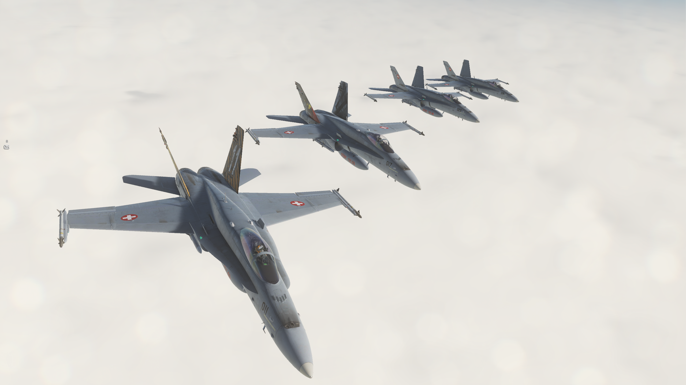

# dSAF

website for the Digital Swiss Air Force community 🚀🇨🇭

We are a group of aviation enthusiasts who simulate certain structures of the Swiss Air Force. For this we use the software
DCS (Digital Combat Simulator) and especially the modules F/A-18C and F-5E, just like in real life.

